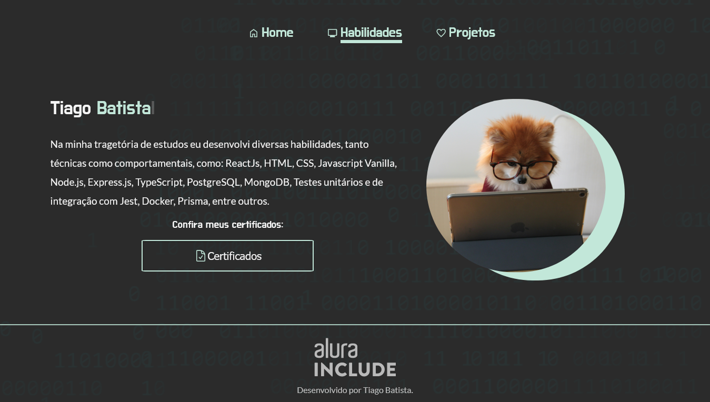

# Portifólio - Tiago Batista

### What to expect

- Usage of HTML, CSS and Javascript
- Responsive Pages and Semantic HTML

#

### Preview

#

### About

This project was done as a challenge given by Alura through [Alura Include](https://www.alura.com.br/empresas/include) program and [Inova Maranhão](https://www.inova.ma.gov.br/). We were given the task of creating our own portfolio based on a simple figma design and some classes on Alura platform.

### Structure

|      File      |                                                                  Description                                                                   |                    Language                     |
| :------------: | :--------------------------------------------------------------------------------------------------------------------------------------------: | :---------------------------------------------: |
|   **assets**   |                                                  Where all images and other files are stored                                                   |                    `svg/XML`                    |
| **javascript** | Where all scripts are. Used to create dynamic interactions with the DOM. Currently only being used to some animations and mobile interactions. |                  `javascript`                   |
|   **styles**   |                                             Where all styles are. They are used to style the pages                                             |     (css is **not** a programming language)     |
| **Main files** |                                                This is where the .html and .md files are found                                                 | (HTML and md is **not** a programming language) |
